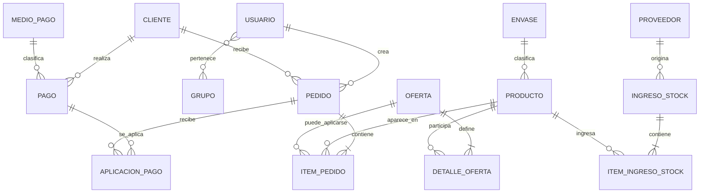
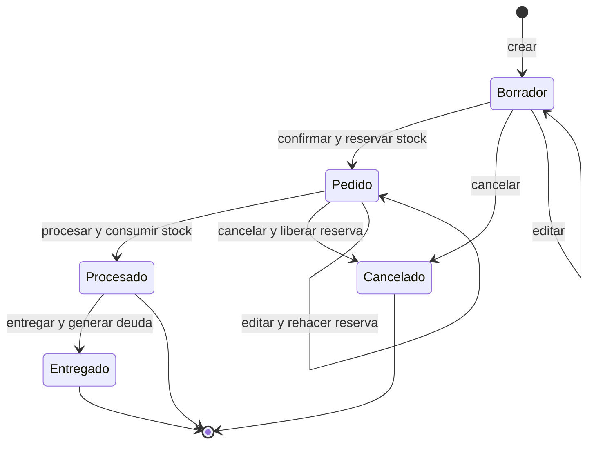

# Nalub - Especificación funcional, técnica y ontológica

**Versión:** 1.0  
**Fecha del relevamiento:** 2026-08-12  
**Propósito:** servir como contexto funcional para una ontología conectada con la base de datos y con la aplicación Nalub.  
**Fuente:** código vigente, documentación del proyecto y scripts SQL disponibles en el repositorio.

> Este documento describe el sistema desde dos perspectivas simultáneas: qué significa cada concepto para el negocio y cómo se materializa actualmente en la aplicación y en la base de datos.

---

## 1. Cómo interpretar este documento

La ontología debería distinguir siempre cuatro niveles:

1. **Concepto de negocio:** por ejemplo, Cliente, Pedido, Producto, Pago u Oferta.
2. **Función del software:** la acción que un usuario puede ejecutar, como crear un pedido o registrar un pago.
3. **Implementación:** páginas, server actions, servicios, repositorios y endpoints que ejecutan la acción.
4. **Persistencia:** tablas, columnas, claves y efectos que quedan registrados en MariaDB.

### 1.1 Estados de certeza

Se usan estas etiquetas:

- **Implementado:** existe en el código vigente y participa del flujo actual.
- **Documentado:** está definido en la documentación de diseño, pero puede no estar completo en código.
- **Parcial:** existe una parte funcional, pero faltan validaciones, permisos, UI o integración.
- **Pendiente:** está explícitamente previsto, pero no debe inferirse como capacidad operativa actual.
- **Inconsistencia:** hay diferencias de nombres, tablas o comportamiento entre código, documentación y SQL.

### 1.2 Regla de prioridad

Para interpretar el comportamiento actual, la prioridad es:

1. Código ejecutable vigente.
2. SQL de instalación o verificación vigente.
3. Documentación de dominio y arquitectura.
4. Documentación histórica o de diseño.

La base de datos legacy es el sistema de registro. La aplicación debe adaptarse a ella; no se debe asumir que un nombre conceptual coincide exactamente con el nombre físico de una columna.

---

## 2. Identidad general del sistema

Nalub es una aplicación web interna de gestión comercial para una empresa que comercializa productos, principalmente productos con presentación o envase, y que necesita administrar:

- clientes;
- vendedores y usuarios internos;
- catálogo de productos;
- tipos de envase;
- pedidos;
- disponibilidad y reserva de stock;
- ingresos de mercadería desde proveedores;
- entregas;
- deuda de clientes;
- recepción y aplicación de pagos;
- ofertas comerciales.

El flujo comercial principal es:

```text
Usuario autenticado
  -> selecciona cliente
  -> arma pedido con productos
  -> guarda pedido Borrador
  -> confirma y reserva stock
  -> procesa y consume stock
  -> entrega pedido
  -> genera deuda del cliente
  -> registra y aplica pagos
```

La aplicación actual usa una arquitectura simple, monolítica y de una sola plataforma:

```text
Next.js App Router
  -> páginas React y formularios
  -> server actions / route handlers
  -> services de dominio
  -> repositories Knex
  -> MariaDB legacy
```

### 2.1 Stack técnico

- Next.js 16.1.7.
- React 19.2.4.
- TypeScript 5.9.
- Knex 3.1.
- MariaDB mediante `mysql2`.
- Tailwind CSS para la interfaz.
- Sesión firmada en cookie HTTP-only.
- Base existente sin migraciones estructurales generales.

### 2.2 Alcance operativo

La solución está pensada para una PYME con pocos usuarios. Se mantiene auditoría parcial utilizando datos existentes:

- `pedidos.login`: usuario creador o vendedor del pedido.
- `pedidos.usuario`: usuario que registra la entrega.

No existe todavía una auditoría de eventos completa para cada cambio de estado, edición o acción administrativa.

---

## 3. Actores y seguridad

### 3.1 Actores de negocio

#### Usuario autenticado

Persona que ingresó con login y contraseña válidos. Puede operar únicamente dentro de las capacidades habilitadas por la sesión y por las reglas de cada módulo.

#### Vendedor - grupo conceptual `Ventas`

Responsable de crear y gestionar pedidos comerciales propios y participar en la recepción de pagos. En el diseño funcional debería ver sus propios pedidos y no operar sobre stock, productos u ofertas.

#### Administrador

Usuario con privilegios administrativos. Opera pedidos de cualquier vendedor y gestiona stock, productos, envases y ofertas. Puede procesar y entregar pedidos.

#### Staff

Grupo previsto por la documentación con comportamiento equivalente al administrador en pedidos, aunque la implementación actual simplifica permisos mediante `isAdmin`.

#### Cliente

Entidad comercial destinataria del pedido. Tiene datos identificatorios, datos logísticos, deuda y relaciones con pedidos y pagos.

#### Proveedor

Entidad que entrega mercadería a la empresa. Se usa al registrar ingresos de stock.

### 3.2 Tablas de seguridad

#### `sec_users`

Usuario autenticable.

| Campo | Significado funcional |
|---|---|
| `login` | Identificador del usuario y referencia usada en pedidos |
| `pswd` | Contraseña almacenada en la base legacy; el código actual compara directamente |
| `active` | Habilitación; se exige valor `Y` para autenticar |
| `name` | Nombre visible |
| `email` | Correo |
| `priv_admin` | Indicador administrativo; `Y` o `1` se transforma en `isAdmin=true` |

#### `sec_groups`

Catálogo de grupos. Campos relevantes: `group_id`, `description`.

#### `sec_users_groups`

Relación muchos-a-muchos entre usuarios y grupos. Campos relevantes: `login`, `group_id`.

La función `getUserGroups(login)` existe en el servicio de autenticación, pero la sesión actual no usa esos grupos para determinar los permisos de cada operación.

### 3.3 Autenticación vigente

1. El usuario envía `login` y `pswd`.
2. `authenticate()` busca coincidencia exacta en `sec_users` y exige `active = 'Y'`.
3. Se crea una sesión con `login`, `name` e `isAdmin`.
4. La sesión se serializa y firma en la cookie `auth_session`.
5. La cookie dura un día, es HTTP-only y usa `secure` en producción.
6. Si la cookie no puede decodificarse, se elimina.

### 3.4 Matriz funcional vigente y objetivo

| Capacidad | Usuario autenticado no admin | Admin (`isAdmin`) | Staff conceptual |
|---|---:|---:|---:|
| Entrar al sistema | Sí | Sí | Sí, si está representado como admin |
| Ver pedidos propios | Sí | Sí | Sí |
| Ver todos los pedidos | No | Sí | Previsto |
| Crear pedidos | Sí | Sí | Previsto |
| Confirmar pedidos propios | Sí | Sí | Previsto |
| Procesar pedidos | No | Sí | Previsto |
| Entregar pedidos | No | Sí | Previsto |
| Cancelar pedidos editables | Sí | Sí | Previsto |
| Ingresar stock | No | Sí | No según menú actual |
| Administrar productos/envases | No | Sí | No según menú actual |
| Administrar ofertas | No bloqueado explícitamente por API; objetivo: admin | Sí desde menú | No |
| Registrar pagos | Sí | Sí | Sí |

**Advertencia:** la matriz conceptual no equivale completamente a la autorización real. Las páginas de productos y stock verifican `isAdmin`; las rutas API de ofertas actualmente no muestran una comprobación de sesión; y `getUserGroups()` no está integrado en el control de permisos.

---

## 4. Mapa de la interfaz

### 4.1 Rutas principales

| Ruta | Función | Estado |
|---|---|---|
| `/login` | Autenticación | Implementado |
| `/opciones` | Panel de módulos y cierre de sesión | Implementado |
| `/pedidos` | Listado, filtros y paginación | Implementado |
| `/pedidos/nuevo` | Alta de pedido en borrador | Implementado |
| `/pedidos/[id]` | Detalle y acciones de ciclo de vida | Implementado, edición visual parcial |
| `/pedidos/[id]/remito` | Vista de remito | Implementado |
| `/stock` | Ingreso de mercadería por proveedor | Implementado |
| `/pagos` | Contexto de deuda, alta de cobro e historial | Implementado |
| `/productos` | Catálogo, búsqueda y stock disponible | Implementado |
| `/productos/nuevo` | Alta de producto | Implementado |
| `/productos/[id]` | Edición de producto | Implementado |
| `/productos/envases` | ABM de envases | Implementado |
| `/ofertas` | Listado y filtros de ofertas | Implementado |
| `/ofertas/nuevo` | Alta de oferta | Implementado |
| `/ofertas/[id]` | Edición y eliminación de oferta | Implementado |
| `/reportes` | Reportes | No implementado; aparece como próximamente |
| Gestión completa de clientes | Alta/edición de clientes | No implementado; solo búsqueda |

### 4.2 API HTTP de Ofertas

| Método | Ruta | Resultado |
|---|---|---|
| `GET` | `/api/ofertas` | Listado con filtros y paginación opcional |
| `POST` | `/api/ofertas` | Valida estructura y crea oferta |
| `GET` | `/api/ofertas/[id]` | Obtiene una oferta con productos |
| `PATCH` | `/api/ofertas/[id]` | Actualiza cabecera y/o detalle |
| `DELETE` | `/api/ofertas/[id]` | Desactiva, elimina o elimina forzadamente según query string |
| `GET` | `/api/ofertas/vigentes` | Ofertas activas dentro de fecha actual |
| `POST` | `/api/ofertas/validar` | Valida vigencia de ofertas referenciadas por items |

La API de otros módulos se implementa principalmente mediante server actions, no mediante endpoints REST separados.

---

## 5. Modelo conceptual del negocio

### 5.1 Clases principales

- `Usuario`
- `Grupo`
- `Cliente`
- `Proveedor`
- `Producto`
- `Envase`
- `Pedido`
- `ItemPedido`
- `IngresoStock`
- `ItemIngresoStock`
- `Oferta`
- `DetalleOferta`
- `Pago`
- `AplicacionPago`
- `MedioPago`

### 5.2 Relaciones conceptuales



### 5.3 Cardinalidades importantes

- Un cliente puede tener muchos pedidos.
- Un pedido pertenece a un cliente y contiene uno o más items en el flujo confirmado.
- Un item de pedido referencia un producto.
- Un producto puede aparecer en muchos items de pedidos.
- Un producto puede tener un envase; un envase puede estar asociado a muchos productos.
- Un proveedor puede tener muchos ingresos de stock.
- Un ingreso de stock tiene una cabecera y varios detalles.
- Una oferta tiene uno o varios productos mediante `ofertas_detalle`.
- Una oferta puede quedar asociada a muchos items si la integración comercial se completa.
- Un pago pertenece a un cliente y puede aplicarse a varios pedidos mediante `aplicapagos`.

---

## 6. Diccionario de datos funcional y físico

> Los nombres que aparecen aquí son los observados en el código o en los SQL del repositorio. Cuando existe diferencia entre documentación y código, se indica expresamente.

### 6.1 `clientes`

Representa al comprador o destinatario comercial del pedido.

| Campo | Tipo conceptual | Uso |
|---|---|---|
| `id` | Identificador | Clave del cliente |
| `nombre` | Texto | Nombre comercial o visible |
| `razonSocial` | Texto | Razón social |
| `cuit` | Texto | Identificador fiscal |
| `localidad` | Texto | Ubicación |
| `idSecundario` | Identificador | Referencia legacy adicional |
| `deuda` | Importe | Deuda acumulada; se incrementa al entregar y se reduce al aplicar pagos |
| `fechaUltimoPago` | Fecha | Fecha del último pago, utilizada por pagos |
| `fechaUltimoMov` | Fecha | Fecha del último movimiento, utilizada por pagos |

Funciones actuales:

- buscar por `nombre`, `razonSocial` o `cuit`;
- listar una selección limitada de clientes;
- seleccionar cliente para crear pedido;
- obtener deuda mediante pedidos con saldo positivo;
- actualizar deuda y fechas al aplicar un pago.

No existe un ABM de clientes en la UI actual.

### 6.2 `productos`

Representa un artículo comercializable y controlable por stock.

| Campo | Significado |
|---|---|
| `id` | Identificador del producto |
| `codigo` | Código comercial; se trata como único en la lógica de alta/edición |
| `nombre` | Descripción comercial |
| `pack` | Texto de presentación o pack |
| `envase` | FK lógica a `envases.id` |
| `precioCompra` | Último precio de compra |
| `precioVenta` | Precio normal de venta |
| `foto` | Imagen binaria almacenada en la base |
| `stockActual` | Existencia física registrada |
| `stockReservado` | Existencia comprometida por pedidos confirmados |
| `rentabilidad` | Porcentaje derivado a partir de compra y venta |
| `litros` | Capacidad o volumen, si está presente en la base |
| `tipoEnvase` | Descripción o clasificación legacy, si está presente |

Reglas:

```text
stockDisponible = stockActual - stockReservado
rentabilidad = ((precioVenta - precioCompra) / precioCompra) * 100
```

Funciones actuales:

- búsqueda por código o nombre;
- listado paginado;
- alta con stock inicial cero;
- edición de datos comerciales e imagen;
- eliminación solo si no tiene pedidos ni ingresos asociados;
- exposición del stock disponible;
- utilización en pedidos, ofertas e ingresos.

### 6.3 `envases`

Catálogo de tipos de envase o capacidad comercial.

| Campo | Significado |
|---|---|
| `id` | Identificador |
| `nombre` | Nombre del envase o capacidad |

Regla de eliminación: no se permite eliminar un envase utilizado por productos.

### 6.4 `pedidos`

Cabecera de la operación comercial.

| Campo | Significado funcional |
|---|---|
| `id` | Número del pedido |
| `cliente` | FK a `clientes.id`; en documentación antigua también aparece como `clienteId` |
| `fecha` | Fecha de creación |
| `login` | Usuario/vendedor que creó el pedido |
| `estado` | Estado del ciclo de vida |
| `bultos` | Suma de cantidades de items |
| `importeTotal` | Suma de importes de items |
| `observacion` | Texto libre |
| `fechaEntrega` | Fecha de entrega |
| `entregadoPor` | Datos del repartidor, si se utiliza |
| `usuario` | Usuario que registró la entrega en la implementación actual |
| `saldo` | Saldo pendiente del pedido |
| `fechaSaldo` | Fecha del último cambio de saldo |

Reglas derivadas:

```text
bultos = SUM(item.cantidad)
importeTotal = SUM(item.precioTotal)
```

### 6.5 `pedidoItems`

Detalle comercial del pedido.

| Campo | Significado |
|---|---|
| `id` | Identificador del item |
| `pedidoId` | FK a `pedidos.id` |
| `productoId` | FK a `productos.id` |
| `cantidad` | Unidades solicitadas |
| `precioUnitario` | Precio aplicado a una unidad |
| `precioTotal` | Importe de la línea |
| `ofertaId` | FK nullable a `ofertas.id` prevista por el SQL de Ofertas |

Regla:

```text
precioTotal = cantidad * precioUnitario
```

**Inconsistencia relevante:** el servicio de Ofertas usa una interfaz `PrepedidoItem` con `ofertaid`, `producto_id`, `importe_unitario` y `prepedido_id`, mientras el módulo de Pedidos usa `PedidoItem` con `ofertaId` conceptual, `productoId`, `precioUnitario` y `pedidoId`. La ontología debe conservar ambos vocabularios como mapeos separados hasta que se unifique el modelo.

### 6.6 `proveedores`

| Campo | Significado |
|---|---|
| `proveedorId` | Identificador |
| `proveedorNombre` | Nombre del proveedor |

### 6.7 `ingStock`

Cabecera del ingreso de mercadería.

| Campo | Significado |
|---|---|
| `IngStockId` | Identificador del ingreso |
| `ProveedorId` | FK a `proveedores.proveedorId` |
| `IngStockFecha` | Fecha del comprobante o ingreso |
| `NroComprobante` | Número de remito/factura/comprobante |
| `IngStockMonto` | Monto total del ingreso |
| `IngStockUnidades` | Total de unidades ingresadas |

### 6.8 `ingStockItems`

Detalle de productos recibidos.

| Campo | Significado |
|---|---|
| `IngStockItemsId` | Identificador del detalle, si existe con ese nombre |
| `IngStockId` | FK a la cabecera |
| `ProductoId` | FK a `productos.id` |
| `IngStockItemsCantidad` | Cantidad ingresada |
| `IngStockItemsPrecioUnitario` | Precio de compra unitario |
| `IngStockItemsPrecioTotal` | Precio total calculado |

### 6.9 `tipoMediosPago`

Catálogo de medios de pago.

| Campo | Significado |
|---|---|
| `id` | Identificador |
| `nombre` | Efectivo, cheque, transferencia u otro |
| `datosAdic` | Indicador de datos adicionales; si vale `S`, el código exige datos de cheque |

### 6.10 `pagos`

Registro del cobro recibido.

| Campo | Significado |
|---|---|
| `id` | Identificador del pago |
| `clienteId` | Cliente que paga |
| `tipoMedioPagoId` | Medio utilizado |
| `fechaRecep` | Fecha de recepción |
| `importe` | Monto cobrado |
| `receptor` | Usuario o vendedor que recibe |
| `observaciones` | Texto libre |
| `estado` | En la implementación se inserta `Imputado` |
| `procesado` | En la implementación se inserta `S` |
| `chFecha` | Fecha del cheque |
| `chVto` | Vencimiento del cheque |
| `chNumero` | Número del cheque |
| `chBanco` | Banco del cheque |

### 6.11 `aplicapagos`

Tabla puente que distribuye un pago entre pedidos.

| Campo | Significado |
|---|---|
| `id` | Identificador |
| `idpago` | FK a `pagos.id` |
| `idpedido` | FK a `pedidos.id` |
| `idcliente` | Cliente de la aplicación, usado por el servicio |
| `fecha` | Fecha de aplicación |
| `importe` | Monto aplicado al pedido |
| `saldo` | Saldo del pedido después de la aplicación |

### 6.12 Tablas de Ofertas

#### `ofertas`

Define la regla comercial.

| Campo | Significado |
|---|---|
| `id` | Identificador |
| `titulo` | Nombre visible |
| `descripcion` | Condiciones comerciales |
| `fecha_inicio` | Inicio de vigencia |
| `fecha_fin` | Fin de vigencia |
| `activa` | Habilitación manual |
| `tipo` | `unitaria`, `minima`, `bundle`, `mix` |
| `modo_precio` | `precio_unitario`, `precio_pack`, `descuento_pct` |
| `valor_precio` | Precio o porcentaje según el modo |
| `min_unidades_total` | Mínimo para `minima` o `mix` |
| `unidad_base` | `unidad` o `caja` |
| `created_at` | Fecha de creación |

#### `ofertas_detalle`

Relaciona ofertas y productos.

| Campo | Significado |
|---|---|
| `id` | Identificador |
| `oferta_id` | FK a `ofertas.id` |
| `producto_id` | FK a `productos.id` |
| `unidades_fijas` | Cantidad fija obligatoria para `bundle` |

Restricciones declaradas:

- `UNIQUE (oferta_id, producto_id)`;
- `ON DELETE CASCADE` desde oferta hacia sus detalles;
- FK a producto para proteger referencias.

### 6.13 Seguridad de la relación Oferta-Pedido

El SQL de Ofertas propone agregar `pedidoItems.ofertaId` nullable con `ON DELETE SET NULL`.

Semántica:

- `NULL`: el item se vendió a precio normal o no tiene una oferta asociada.
- número: el item fue asociado a una oferta.
- eliminar una oferta no debería eliminar el item histórico; solo dejar la referencia en `NULL`.

En el código actual, esta integración todavía no está conectada al alta/edición/confirmación de pedidos.

---

## 7. Funciones por módulo

## 7.1 Acceso y navegación

### Iniciar sesión

**Actor:** cualquier usuario registrado y activo.  
**Entrada:** `login`, `pswd`.  
**Persistencia consultada:** `sec_users`.  
**Salida:** sesión firmada o error de credenciales.

### Abrir panel de opciones

**Actor:** usuario autenticado.  
**Función:** ofrece accesos a Pedidos, Stock, Pagos, Productos y Ofertas.  
**Regla:** Stock se muestra habilitado solo si `session.isAdmin`; Productos está protegido por admin en su página. Reportes, Clientes y Configuración aparecen como módulos futuros.

### Cerrar sesión

Elimina la cookie de sesión y redirige a `/login`.

## 7.2 Pedidos

El Pedido es la entidad central de la operación comercial.

### Listar pedidos

**Actor:** usuario autenticado.  
**Entrada:** estado, cliente, rango de fechas y página.  
**Consulta:** `pedidos` unido a `clientes`.  
**Salida:** lista paginada con cliente, fecha, importe, bultos y estado.

Regla de alcance actual:

- admin: consulta todos los pedidos;
- no admin: se agrega `pedidos.login = session.login`.

### Crear pedido borrador

**Actor:** vendedor o admin.  
**Entrada:** cliente, observación e items.

Pasos:

1. seleccionar un cliente;
2. agregar productos desde el selector;
3. indicar cantidades;
4. calcular precios en el formulario;
5. ejecutar `createPedidoAction`;
6. insertar cabecera e items en una transacción;
7. iniciar estado `Borrador`.

Efectos:

- inserta en `pedidos`;
- inserta en `pedidoItems`;
- calcula `bultos`;
- calcula `importeTotal`;
- no toca stock.

El login persistido debe provenir de la sesión del servidor, aunque el formulario envía datos adicionales.

### Editar items

La capacidad de servicio está prevista para pedidos `Borrador` y `Pedido`; se reemplazan los items y se recalculan bultos e importe.

Reglas del servicio:

- `Borrador`: edición sin reserva;
- `Pedido`: libera reservas anteriores, reemplaza items, revalida stock y reserva nuevamente;
- `Procesado`, `Entregado` y `Cancelado`: no editables.

**Estado UI:** la pantalla de detalle muestra controles de edición, pero parte de ellos todavía son visuales y no están conectados a una acción de actualización en el componente vigente.

### Confirmar pedido

**Transición:** `Borrador -> Pedido`.  
**Actor:** usuario con permiso sobre el pedido.

Precondiciones:

- pedido existente;
- estado actual `Borrador`;
- items válidos;
- cada producto existente;
- stock suficiente.

Regla de disponibilidad:

```text
stockDisponible = stockActual - stockReservado
```

Efectos transaccionales:

1. se cargan los items;
2. se verifica stock de cada producto;
3. se incrementa `productos.stockReservado` por cantidad;
4. se actualiza `pedidos.estado = 'Pedido'`.

Si una validación falla, la transacción debe revertir los cambios.

### Procesar pedido

**Transición:** `Pedido -> Procesado`.  
**Actor:** admin.

Efectos:

- `productos.stockActual -= cantidad`;
- `productos.stockReservado -= cantidad`;
- `pedidos.estado = 'Procesado'`.

El pedido ya no puede editarse ni cancelarse después de este estado.

### Entregar pedido

**Transición:** `Procesado -> Entregado`.  
**Actor:** admin.

Efectos:

- actualiza estado;
- registra `fechaEntrega`;
- registra usuario en `pedidos.usuario`;
- incrementa `clientes.deuda` por `pedidos.importeTotal`.

La deuda se genera en la entrega, no en la creación ni en la confirmación del pedido.

### Cancelar pedido

**Actor:** usuario autorizado.  
**Transiciones:** `Borrador -> Cancelado` o `Pedido -> Cancelado`.

Si el pedido estaba en `Pedido`, se libera `stockReservado`. No se elimina físicamente el pedido; se conserva para trazabilidad.

No se permite cancelar `Procesado` ni `Entregado`.

### Consultar detalle y remito

El detalle reúne cabecera, cliente, vendedor, estado, items, totales y observaciones. La ruta de remito presenta los datos del pedido para impresión/entrega.

## 7.3 Stock

### Consultar productos y disponibilidad

El catálogo muestra stock actual, stock reservado y disponibilidad calculada:

```text
disponible = stockActual - stockReservado
```

### Registrar ingreso de mercadería

**Actor:** admin.  
**Entrada:** proveedor, número de comprobante, fecha e items.

Cada item contiene:

- `productoId`;
- `cantidad` mayor a cero;
- `precioUnitario` mayor o igual a cero.

Proceso transaccional:

1. validar proveedor;
2. validar que todos los productos existan;
3. calcular monto y unidades;
4. insertar `ingStock`;
5. insertar `ingStockItems`;
6. incrementar `productos.stockActual`;
7. actualizar `productos.precioCompra`;
8. recalcular `productos.rentabilidad` si hay precio de venta.

Reglas de cálculo:

```text
IngStockUnidades = SUM(cantidad)
IngStockMonto = SUM(cantidad * precioUnitario)
IngStockItemsPrecioTotal = cantidad * precioUnitario, redondeado en detalle
```

La operación devuelve el id del ingreso, monto, unidades y login del usuario ejecutor. El esquema observado no presenta un campo de usuario en `ingStock`, por lo que ese login no queda necesariamente persistido.

## 7.4 Productos y envases

### Buscar producto

Busca por `nombre` o `codigo`, incorpora información de `envases` y devuelve datos comerciales, imagen y stock.

### Crear producto

**Actor:** admin.  
**Requeridos:** código y nombre.  
**Opcionales:** pack, envase, precio de compra, precio de venta e imagen.

Al crear:

- `stockActual = 0`;
- `stockReservado = 0`;
- `rentabilidad = NULL`;
- la imagen base64 se convierte a binario.

No se permite duplicar el código.

### Actualizar producto

Permite modificar datos comerciales, precios, envase e imagen. Si cambian los precios, recalcula rentabilidad.

### Eliminar producto

Solo si no tiene:

- items en `pedidoItems`;
- detalles en `ingStockItems`.

La protección evita romper el historial comercial y de stock.

### Crear, actualizar y eliminar envase

El catálogo `envases` se administra por nombre. No se elimina un envase utilizado por algún producto.

## 7.5 Clientes y cuenta corriente

El módulo de clientes se encuentra parcialmente implementado.

Funciones actuales:

- búsqueda de clientes para formularios;
- listado limitado para selección;
- lectura de deuda asociada a pedidos;
- actualización de deuda al registrar pagos.

No existe un mantenimiento completo de clientes desde la UI actual.

## 7.6 Pagos y deuda

### Consultar contexto de deuda

Para un cliente, se consulta:

- deuda total como suma de `pedidos.saldo` positivos;
- hasta 20 pedidos pendientes ordenados por fecha e id.

### Registrar pago

**Actor:** usuario autenticado.  
**Entrada:** cliente, medio de pago, fecha, importe, receptor y datos adicionales.

Validaciones:

- cliente existente;
- medio de pago existente;
- receptor existente en `sec_users`;
- importe positivo;
- deuda pendiente mayor a cero;
- importe no mayor que la deuda;
- número y banco si el medio exige datos adicionales de cheque.

Aplicación automática:

1. se ordenan pedidos pendientes por antigüedad;
2. se aplica el pago al pedido más antiguo primero;
3. se inserta una fila en `aplicapagos` por cada pedido afectado;
4. se actualiza `pedidos.saldo` y `pedidos.fechaSaldo`;
5. se actualiza `clientes.deuda`, `fechaUltimoPago` y `fechaUltimoMov`;
6. se guarda el pago en `pagos` con estado `Imputado` y procesado `S`.

Todo ocurre en una transacción. Si no se puede imputar el total, se produce error y se revierte la operación.

### Historial de pagos

Muestra pagos recientes unidos a cliente y medio, junto con sus aplicaciones a pedidos.

## 7.7 Ofertas comerciales

Una Oferta es una regla comercial temporal aplicable a uno o varios productos.

### Tipos de oferta

#### `unitaria`

Exactamente un producto. Se aplica un precio especial al producto.

#### `minima`

Exactamente un producto y una cantidad mínima total. La condición se activa al alcanzar ese mínimo.

#### `bundle`

Dos o más productos, cada uno con `unidades_fijas`, y precio en modo `precio_pack`.

#### `mix`

Dos o más productos y una cantidad mínima total combinada.

### Modos de precio

#### `precio_unitario`

```text
precioConOferta = valor_precio
precioTotal = precioConOferta * cantidad
```

#### `precio_pack`

```text
precioTotal = valor_precio
precioConOferta = precioTotal / cantidad
```

#### `descuento_pct`

```text
descuento = (valor_precio / 100) * precioNormal
precioConOferta = precioNormal - descuento
precioTotal = precioConOferta * cantidad
```

La función de cálculo también devuelve ahorro absoluto por unidad y porcentaje de ahorro.

### Validación estructural de una oferta

Se valida:

- título obligatorio;
- fechas obligatorias;
- inicio anterior o igual al fin;
- valor de precio positivo;
- descuento entre 1 y 99 cuando el modo es porcentual;
- al menos un producto;
- cantidad exacta de productos para `unitaria` y `minima`;
- mínimo mayor a cero para `minima` y `mix`;
- mínimo de dos productos para `bundle` y `mix`;
- `bundle` debe usar `precio_pack`;
- todos los productos de `bundle` deben tener unidades fijas positivas.

### Vigencia

Una oferta es vigente si se cumplen simultáneamente:

```text
activa = true
fecha_inicio <= fecha_actual
fecha_fin >= fecha_actual
```

### Crear y actualizar

El alta inserta cabecera en `ofertas` y detalles en `ofertas_detalle`. La actualización puede modificar cabecera y reemplazar el conjunto de productos asociado.

### Desactivar y eliminar

- `soft=true`: actualiza `ofertas.activa = false`.
- eliminación física: elimina la cabecera y, por cascada, sus detalles.
- `force=true`: se diseñó para permitir que los items queden con referencia de oferta nula.

**Estado actual:** el endpoint de eliminación contiene un contador fijo `itemsUsandoOferta = 0`; todavía no consulta los items reales antes de decidir si la oferta está en uso.

### Validar ofertas antes de enviar

Existe una función que recibe items con `ofertaid`, carga cada oferta y marca como inválida una oferta:

- inexistente;
- desactivada;
- todavía no vigente;
- expirada.

Existe el endpoint `/api/ofertas/validar`, pero el flujo actual de creación y confirmación de pedidos no lo invoca. La selección de ofertas en el pedido tampoco está integrada.

---

## 8. Ciclo de vida del pedido



### 8.1 Tabla de estados

| Estado | Significado | Stock | Edición | Cancelación |
|---|---|---|---|---|
| `Borrador` | Pedido en construcción | No reserva | Sí | Sí |
| `Pedido` | Pedido confirmado | Reserva stock | Sí, con revalidación | Sí, libera reserva |
| `Procesado` | Stock consumido/preparado | Reserva liberada y stock real descontado | No | No |
| `Entregado` | Mercadería entregada | Ya consumido | No | No |
| `Cancelado` | Operación anulada | Reserva liberada si correspondía | No | No |

### 8.2 Reglas de transición

- Confirmar solo desde `Borrador`.
- Procesar solo desde `Pedido`.
- Entregar solo desde `Procesado`.
- Cancelar desde `Borrador` o `Pedido`.
- No procesar pedidos sin items.
- No confirmar sin stock suficiente.
- No editar pedidos procesados, entregados o cancelados.
- No generar deuda antes de la entrega.

---

## 9. Efectos transaccionales y reglas de consistencia

### 9.1 Operaciones que deben ser atómicas

La aplicación usa transacciones para:

- crear pedido con sus items;
- confirmar pedido y reservar stock;
- editar pedido confirmado y rehacer reserva;
- procesar pedido y consumir stock;
- entregar pedido y generar deuda;
- cancelar pedido con liberación de reserva;
- registrar ingreso de stock y actualizar productos;
- crear pago y aplicar saldo a pedidos.

### 9.2 Invariantes del dominio

Estas condiciones deberían permanecer verdaderas:

```text
pedido.bultos = SUM(pedidoItems.cantidad)
pedido.importeTotal = SUM(pedidoItems.precioTotal)
pedidoItem.precioTotal = pedidoItem.cantidad * pedidoItem.precioUnitario
producto.stockDisponible = producto.stockActual - producto.stockReservado
```

Además:

- una reserva solo corresponde a pedidos en estado `Pedido`;
- procesar un pedido consume su reserva una sola vez;
- cancelar un pedido confirmado libera su reserva una sola vez;
- una oferta puede no tener detalle duplicado para el mismo producto;
- un producto con historial de pedidos o ingresos no debe eliminarse;
- un envase utilizado por productos no debe eliminarse;
- un pago no debe superar la deuda total del cliente;
- la suma de aplicaciones de un pago debe ser igual a su importe.

### 9.3 Cálculos que no deberían confiarse a la UI

- importe total de pedido;
- bultos;
- stock disponible;
- monto y unidades de ingreso de stock;
- rentabilidad;
- saldo de pedido después de pago;
- deuda posterior del cliente;
- precio total de oferta.

---

## 10. Trazabilidad función -> código -> datos

| Función | Entrada | Punto de aplicación | Tablas principales | Efecto |
|---|---|---|---|---|
| Autenticar | login, pswd | `auth/service.ts` | `sec_users` | Crea sesión |
| Buscar cliente | texto | `clientes/service.ts` | `clientes` | Devuelve candidatos |
| Crear borrador | cliente, items | `pedidos/actions.ts` + repository | `pedidos`, `pedidoItems` | Inserta pedido |
| Confirmar pedido | pedido id | `pedidos/service.ts` | `pedidos`, `productos` | Reserva stock |
| Procesar pedido | pedido id | `pedidos/service.ts` | `pedidos`, `productos` | Consume stock |
| Entregar pedido | pedido id, login | `pedidos/service.ts` | `pedidos`, `clientes` | Fecha entrega y deuda |
| Cancelar pedido | pedido id | `pedidos/service.ts` | `pedidos`, `productos` | Estado y liberación |
| Ingresar stock | proveedor, comprobante, items | `stock/service.ts` | `ingStock`, `ingStockItems`, `productos` | Aumenta existencia |
| Alta producto | datos de catálogo | `productos/actions.ts` + repository | `productos` | Crea producto |
| ABM envase | nombre | `productos/actions.ts` + repository | `envases` | Mantiene catálogo |
| Consultar deuda | cliente id | `pagos/service.ts` | `pedidos` | Suma saldos |
| Registrar pago | datos de pago | `pagos/service.ts` | `pagos`, `aplicapagos`, `pedidos`, `clientes` | Imputa y reduce deuda |
| Crear oferta | regla y productos | API + `ofertas/service.ts` | `ofertas`, `ofertas_detalle` | Crea promoción |
| Listar vigentes | fecha actual | `ofertas/repository.ts` | `ofertas`, `ofertas_detalle`, `productos` | Devuelve promociones válidas |
| Validar oferta | items con oferta | API + `ofertas/service.ts` | `ofertas` | Informa vigencia |

---

## 11. Representación ontológica recomendada

### 11.1 Clases

```text
nalub:Usuario
nalub:Grupo
nalub:Cliente
nalub:Proveedor
nalub:Producto
nalub:Envase
nalub:Pedido
nalub:ItemPedido
nalub:IngresoStock
nalub:ItemIngresoStock
nalub:Oferta
nalub:DetalleOferta
nalub:Pago
nalub:AplicacionPago
nalub:MedioPago
nalub:EstadoPedido
nalub:TipoOferta
nalub:ModoPrecio
```

### 11.2 Propiedades de objeto

```text
nalub:usuarioCreaPedido
nalub:pedidoPerteneceACliente
nalub:pedidoContieneItem
nalub:itemRefiereAProducto
nalub:productoUsaEnvase
nalub:proveedorOriginaIngreso
nalub:ingresoContieneItem
nalub:itemIngresoRefiereAProducto
nalub:ofertaIncluyeProducto
nalub:itemPedidoUsaOferta
nalub:pagoPerteneceACliente
nalub:pagoUsaMedio
nalub:pagoSeAplicaA
nalub:usuarioPerteneceAGrupo
```

### 11.3 Propiedades de datos

```text
nalub:tieneId
nalub:tieneCodigo
nalub:tieneNombre
nalub:tieneDescripcion
nalub:tieneFecha
nalub:tieneFechaInicio
nalub:tieneFechaFin
nalub:tieneCantidad
nalub:tienePrecioUnitario
nalub:tienePrecioTotal
nalub:tieneImporte
nalub:tieneStockActual
nalub:tieneStockReservado
nalub:tieneStockDisponible
nalub:tieneDeuda
nalub:tieneEstado
nalub:tieneLogin
nalub:tieneObservacion
```

### 11.4 Eventos de negocio

Conviene modelar como eventos, además de como simples updates de tablas:

```text
nalub:UsuarioAutenticado
nalub:PedidoCreado
nalub:ItemAgregadoAPedido
nalub:PedidoConfirmado
nalub:StockReservado
nalub:PedidoProcesado
nalub:StockConsumido
nalub:PedidoEntregado
nalub:DeudaGenerada
nalub:PedidoCancelado
nalub:StockIngresado
nalub:ProductoCreado
nalub:ProductoActualizado
nalub:PagoRegistrado
nalub:PagoAplicado
nalub:OfertaCreada
nalub:OfertaDesactivada
nalub:OfertaValidada
```

### 11.5 Reglas inferibles como axiomas o consultas

```text
Si Pedido.estado = 'Pedido', entonces puede existir una reserva de stock asociada.
Si Pedido.estado = 'Procesado', entonces la reserva correspondiente debe haber sido liberada.
Si Pedido.estado = 'Entregado', entonces Cliente.deuda puede haber aumentado por Pedido.importeTotal.
Si Pago se aplica a Pedido, entonces Pedido.saldo debe disminuir.
Si Oferta.activa = true y fecha_inicio <= hoy <= fecha_fin, Oferta es Vigente.
Si Producto.stockReservado > Producto.stockActual, existe una inconsistencia de stock.
Si PedidoItem.ofertaId IS NULL, el item no tiene una oferta persistida.
```

---

## 12. Inconsistencias y límites que la ontología debe conocer

### 12.1 `pedidoItems` versus `prepedidos_items`

La implementación principal de Pedidos usa `pedidos` y `pedidoItems`. La documentación y el módulo de Ofertas mencionan `prepedidos_items` y `PrepedidoItem`. No deben tratarse automáticamente como la misma tabla.

### 12.2 `ofertaId` versus `ofertaid`

El SQL de integración propone `ofertaId` en `pedidoItems`; el servicio de Ofertas espera `ofertaid`. Son nombres distintos y probablemente representan la misma relación conceptual, pero requieren una decisión de integración.

### 12.3 `productoId` versus `producto_id`

Pedidos y SQL legacy usan camelCase (`productoId`); Ofertas usa snake_case (`producto_id`). El mapeo debe declararse explícitamente.

### 12.4 `pedidoId` versus `prepedido_id`

La misma diferencia aparece en la referencia a la cabecera.

### 12.5 Permisos

La documentación define grupos `Ventas`, `Administrador` y `Staff`; la implementación de sesión reduce el permiso a `isAdmin`. `getUserGroups()` existe, pero no constituye todavía la fuente efectiva de autorización.

### 12.6 Ofertas no integradas al pedido

La gestión de ofertas está implementada de forma independiente. La creación de pedidos vigente utiliza precio de catálogo y no selecciona ni persiste una oferta. La validación de vigencia está disponible como API, pero no bloquea todavía la confirmación del pedido.

### 12.7 Conteo de uso al eliminar oferta

El endpoint de eliminación mantiene un placeholder que informa cero items en uso. No debe inferirse que la eliminación siempre es segura respecto del historial hasta completar esa consulta.

### 12.8 Autenticación de API de ofertas

La documentación declara autenticación requerida, pero los route handlers mostrados no realizan actualmente una comprobación explícita de sesión o rol.

### 12.9 Deuda y saldo

La entrega incrementa `clientes.deuda`; el servicio de pagos calcula pendientes usando `pedidos.saldo`. La ontología debería representar ambos atributos y exigir una verificación de consistencia entre ellos, porque son dos niveles de saldo distintos: deuda agregada del cliente y saldo pendiente de cada pedido.

### 12.10 Auditoría

La auditoría es parcial. No existe una entidad histórica de transición de estado ni un registro completo de quién editó cada entidad.

---

## 13. Capacidades fuera de alcance o no implementadas

- Reportes y métricas avanzadas.
- ABM completo de clientes.
- Configuración general.
- Administración avanzada de usuarios.
- Facturación.
- Cuenta corriente detallada independiente del flujo de pagos.
- Auditoría completa de eventos.
- Integración end-to-end de Ofertas con Pedido.
- Tests automatizados de servicios y APIs.
- Conteo real de items al eliminar Ofertas.

Estas capacidades pueden existir como intención de producto o documentación, pero no deben usarse como hechos actuales de la aplicación.

---

## 14. Consultas útiles para conectar ontología y base

### 14.1 Inventario real de tablas y columnas

```sql
SELECT TABLE_NAME, COLUMN_NAME, DATA_TYPE, IS_NULLABLE, COLUMN_KEY, EXTRA
FROM INFORMATION_SCHEMA.COLUMNS
WHERE TABLE_SCHEMA = DATABASE()
ORDER BY TABLE_NAME, ORDINAL_POSITION;
```

### 14.2 Relaciones físicas declaradas

```sql
SELECT
  TABLE_NAME,
  COLUMN_NAME,
  CONSTRAINT_NAME,
  REFERENCED_TABLE_NAME,
  REFERENCED_COLUMN_NAME
FROM INFORMATION_SCHEMA.KEY_COLUMN_USAGE
WHERE TABLE_SCHEMA = DATABASE()
  AND REFERENCED_TABLE_NAME IS NOT NULL
ORDER BY TABLE_NAME, COLUMN_NAME;
```

### 14.3 Estado operativo de pedidos

```sql
SELECT estado, COUNT(*) AS cantidad
FROM pedidos
GROUP BY estado;
```

### 14.4 Disponibilidad de productos

```sql
SELECT
  id,
  codigo,
  nombre,
  stockActual,
  stockReservado,
  COALESCE(stockActual, 0) - COALESCE(stockReservado, 0) AS stockDisponible
FROM productos;
```

### 14.5 Deuda por cliente

```sql
SELECT
  c.id,
  c.nombre,
  c.deuda,
  COALESCE(SUM(CASE WHEN p.saldo > 0 THEN p.saldo ELSE 0 END), 0) AS saldoPedidos
FROM clientes c
LEFT JOIN pedidos p ON p.cliente = c.id
GROUP BY c.id, c.nombre, c.deuda;
```

### 14.6 Uso de ofertas en items

La consulta depende de cuál nombre exista físicamente:

```sql
SELECT ofertaId, COUNT(*) AS cantidad
FROM pedidoItems
WHERE ofertaId IS NOT NULL
GROUP BY ofertaId;
```

Antes de ejecutar esta consulta debe verificarse la existencia de la columna mediante `INFORMATION_SCHEMA.COLUMNS`, porque la integración puede no haberse aplicado.

---

## 15. Resumen para ingestión ontológica

Nalub representa una operación comercial donde:

1. Un `Usuario` crea un `Pedido` para un `Cliente`.
2. El pedido contiene `ItemPedido`.
3. Cada item refiere a un `Producto`.
4. El producto posee precio, presentación y estado de stock.
5. Confirmar un pedido reserva stock.
6. Procesar un pedido consume stock.
7. Entregar un pedido genera deuda para el cliente.
8. Un `Pago` del cliente se distribuye mediante `AplicacionPago` entre pedidos pendientes.
9. Un `Proveedor` origina `IngresoStock`, que incrementa existencias y actualiza precio de compra.
10. Una `Oferta` define una regla temporal sobre uno o más productos.
11. Una oferta es válida cuando está activa y dentro de su rango de fechas.
12. La asociación oferta-item está prevista en la base, pero todavía no está integrada en el flujo principal de pedidos.
13. La base legacy es el sistema de registro y los nombres físicos deben mapearse con cuidado.

La ontología debería conservar la distinción entre:

```text
Pedido != ItemPedido
Producto != StockDisponible
Cliente.deuda != Pedido.saldo
Oferta != DetalleOferta
Usuario != Grupo
IngresoStock != ItemIngresoStock
```

y debería registrar como metadatos de calidad la fuente de cada afirmación: código, SQL, documentación de diseño o inferencia.
