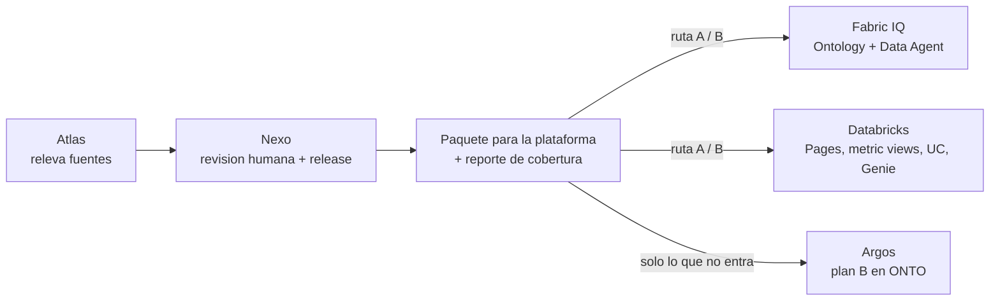

# Integracion con Fabric y Databricks

Estado: release 1 implementada (paquetes de archivos importables). Conectores directos planificados.
Relacion con el foco: ONTO **no compite** con la ontologia de Fabric ni con la de Databricks. Releva, valida y **entrega** a esas plataformas. Solo sostiene por su cuenta lo que la plataforma no puede implementar (plan B).

## 1. Resumen ejecutivo

| Pregunta | Respuesta corta |
| --- | --- |
| Como entiende Fabric una ontologia | Como un item **Ontology** de Fabric IQ: tipos de entidad con propiedades, relaciones y vinculos a tablas de Lakehouse. Las definiciones, reglas y KPIs en lenguaje natural van al **Data Agent** como instrucciones. |
| Como entiende Databricks una ontologia | Como la **capa semantica de Unity Catalog** (Genie Ontology): Pages (conceptos de negocio), metric views (KPIs gobernados), dominios, comentarios y tags en tablas y columnas. Genie Agents la consume para responder. |
| Como les entregamos lo aprobado hoy | Nexo genera, desde una release aprobada, un **paquete de archivos** que cada plataforma importa: JSON de definicion de item (Fabric), Markdown, YAML y SQL (Databricks), y los cuerpos de request listos para la API. |
| Hace falta conector | No para la release 1. El paquete se importa con Git integration, la API REST o el editor SQL. El conector directo es la release 2. |
| Que pasa con lo que no entra | El paquete incluye un **reporte de cobertura** por elemento y recomienda la ruta: **A** (todo en la plataforma) o **B** (mixta: plataforma + ONTO como plan B). |



## 2. Como interpreta cada plataforma

### 2.1 Microsoft Fabric (Fabric IQ)

- **Item Ontology** (preview). Definicion en partes:
  - `.platform` y `definition.json`;
  - `EntityTypes/{id}/definition.json`: nombre (regex `^[a-zA-Z][a-zA-Z0-9_-]{0,127}$`), id numerico, propiedades tipadas (`String`, `Boolean`, `DateTime`, `Object`, `BigInt`, `Double`) y propiedad de nombre visible;
  - `EntityTypes/{id}/DataBindings/{guid}.json`: vinculo a una tabla de Lakehouse (requiere ids de workspace e item). Eventhouse solo para series de tiempo;
  - `RelationshipTypes/{id}/definition.json`: relacion origen/destino entre tipos de entidad;
  - `Documents`, `Overviews`, `ResourceLinks` (por ejemplo un reporte de Power BI).
- La definicion **no tiene campo de descripcion** para entidades. Por eso las definiciones, reglas de negocio, sinonimos y KPIs van al **Data Agent**:
  - `Files/Config/data_agent.json`;
  - `Files/Config/draft/stage_config.json` con `aiInstructions`;
  - por fuente: `datasource.json` con `dataSourceInstructions` y descripciones de elementos, y `fewshots.json` (pares pregunta/consulta).
- Formas de crear: API REST `POST /v1/workspaces/{workspaceId}/ontologies` con las partes en base64, o carpeta del item en un repo conectado por **Git integration**.

### 2.2 Databricks (Unity Catalog semantics / Genie)

- **Pages** (beta): conceptos de negocio con dominio, responsable, sinonimos, descripcion, cuerpo y activos relacionados. Se crean en la UI o por *bulk import* desde documentos. No vimos API publica.
- **Metric views**: KPIs gobernados en YAML (version 1.1) con `source`, `joins`, `dimensions` y `measures` (nombre, expresion, comentario, sinonimos, formato). Se crean con `CREATE VIEW ... WITH METRICS LANGUAGE YAML AS $$ ... $$`.
- **Dominios y certificacion**: tags gobernados.
- **Comentarios, tags y constraints** de Unity Catalog: por SQL (`COMMENT ON`, `SET TAGS`, PK/FK).
- **Genie Agents** (antes Spaces): API `POST /api/2.0/genie/spaces` con `serialized_space` (version 2): tablas con descripcion y sinonimos de columnas, metric views, instrucciones de texto, ejemplos pregunta-SQL, joins, snippets y benchmarks. Los ids son hex de 32 caracteres y las listas van ordenadas.
- **Instrucciones de workspace** para Genie One: `/Workspace/.genie_workspace_instructions.md` (menos de 20.000 caracteres).

## 3. Correspondencia de elementos ONTO

| Elemento aprobado en Nexo | Fabric IQ | Databricks | Si no entra |
| --- | --- | --- | --- |
| Concepto / entidad | Tipo de entidad (Ontology) | Page | - |
| Propiedad | Propiedad del tipo de entidad (tipo a completar) | Seccion de la Page | - |
| Relacion | Tipo de relacion | Page e instrucciones del Genie Agent (join spec en R1.1) | - |
| Sinonimo | Instruccion del Data Agent | Sinonimos de Page y columnas | - |
| Regla de negocio | Instruccion del Data Agent | Instruccion del Genie Agent / Page | - |
| KPI | Instruccion del Data Agent (+ medida en el modelo semantico) | Metric view (expresion a completar) | - |
| Activo tecnico | Tabla del Lakehouse / modelo Power BI | Tabla de Unity Catalog | Plan B si la fuente esta fuera de alcance |
| Binding | DataBinding (requiere ids) | `COMMENT ON` + tags | Plan B si la fuente esta fuera de alcance |

Estados del reporte de cobertura:

- **Nativo**: se implementa tal cual.
- **Completar en la plataforma**: el paquete deja el esqueleto; falta un dato que solo conoce el equipo de la plataforma (ids, expresion SQL, tipo de dato).
- **Como instruccion**: entra como texto para el agente de IA de la plataforma.
- **Fuera de alcance**: la fuente no es alcanzable por esa plataforma (por ejemplo, un ERP on-premise). Queda en ONTO (plan B) o se trae con un puente: Mirroring/shortcuts en Fabric, Lakehouse Federation en Databricks.

Si algun elemento queda fuera de alcance, la ruta recomendada es **B (mixta)**. Si todo es implementable, **A**.

## 4. Que genera ONTO hoy (release 1)

Desde Nexo, pestana **Release y entrega a la plataforma**, o con `prepare_interoperability_package(...)`:

```text
data/interoperability/<proyecto>/<release>/<destino>/<paquete>/
  publication_manifest.json   mapping.json   deployment_manifest.json   coverage.json
  export/
    coverage_report.md
    fabric/
      ontology/<Nombre>.Ontology/.platform, definition.json, EntityTypes/..., RelationshipTypes/...
      ontology/create_ontology_request.json        # cuerpo listo para la API REST
      data_agent/<Nombre>_agent.DataAgent/Files/Config/data_agent.json, draft/stage_config.json
      README_IMPLEMENTACION.md
    databricks/
      pages/<concepto>.md
      metric_views/<kpi>.yaml
      unity_catalog_comments.sql
      genie_workspace_instructions.md
      genie_agent_create_request.json               # cuerpo listo para la API de Genie
      README_IMPLEMENTACION.md
```

La pantalla muestra la ruta recomendada, cuantos elementos se implementan en la plataforma, la tabla de cobertura y un boton para **descargar el paquete en ZIP**. Parametros opcionales: nombre de la ontologia (Fabric); catalogo y warehouse (Databricks).

Validado con las demos: la demo comercial (fuente Power BI) recomienda **ruta A** en Fabric (13/13). La demo distribuida (ERP MariaDB + CRM SQL Server + lakehouse Databricks + Power BI) recomienda **ruta B** en ambas plataformas: 26/39 en Fabric y 33/45 en Databricks.

## 5. Como se importa

**Fabric**

1. Revisar `coverage_report.md`.
2. Opcion Git: copiar la carpeta `<Nombre>.Ontology` al repo conectado al workspace y sincronizar. Opcion API: enviar `create_ontology_request.json` a `POST https://api.fabric.microsoft.com/v1/workspaces/{workspaceId}/ontologies` con identidad Entra autorizada.
3. En el editor de la ontologia: completar tipos de propiedad y vincular cada tipo de entidad a su tabla de Lakehouse.
4. Crear el Data Agent (o copiar la carpeta `.DataAgent`) y agregar las fuentes de datos. Las instrucciones ya vienen redactadas.

**Databricks**

1. Revisar `coverage_report.md` y reemplazar identificadores si el catalogo no coincide.
2. Ejecutar `unity_catalog_comments.sql` en un SQL warehouse.
3. Completar las expresiones de cada metric view y crearlas con `CREATE VIEW ... WITH METRICS LANGUAGE YAML`.
4. Cargar las Pages (UI o bulk import desde los `.md`).
5. Crear el Genie Agent con `genie_agent_create_request.json` y subir `genie_workspace_instructions.md` al workspace.

## 6. Limites conocidos

- Fabric IQ Ontology y Databricks Pages estan en preview/beta: los formatos pueden cambiar. El generador esta aislado en `platform_exports.py` para ajustarlo sin tocar Atlas ni Nexo.
- ONTO no conoce ids de workspace, lakehouse ni warehouse: los DataBindings de Fabric y el `warehouse_id` de Databricks se completan en la plataforma (o se pasan como parametro).
- Las expresiones de KPI no se inventan: el metric view sale con `COMPLETAR_EXPRESION_AGREGADA` hasta que el equipo de datos la defina.
- Los tipos de propiedad salen como `String` salvo que se completen.
- No se publica nada ni se usan credenciales en la release 1.

## 7. Plan de implementacion y proximos pasos

| Fase | Entregable | Estado |
| --- | --- | --- |
| R1 - Paquetes de archivos | Generador Fabric + Databricks, reporte de cobertura, ruta A/B, descarga ZIP en Nexo, tests | **Hecho** |
| R1.1 - Completar desde el origen | Tipos de propiedad desde la metadata tecnica; join specs desde relaciones y FK; ejemplos pregunta-SQL desde el catalogo de consultas; benchmarks desde la bateria de Argos; nombres de 3 partes desde el CSV de Databricks | Siguiente |
| R1.2 - Viabilidad por plataforma en Atlas | Atlas estima por fuente si es alcanzable por la plataforma destino (y por que puente), para anticipar la ruta antes de Nexo | Siguiente |
| R2 - Conectores de publicacion | Fabric: crear/actualizar Ontology y Data Agent por REST con identidad Entra delegada. Databricks: Genie Agents API y SQL Statement Execution para comentarios y metric views. Con aprobacion explicita, auditoria y rollback | Planificado |
| R2.1 - DataBindings | Seleccion de Lakehouse/tabla/columna en Nexo y generacion de `DataBindings` de Fabric | Planificado |
| R3 - Sincronizacion | Importar la ontologia existente de la plataforma como evidencia, comparar con la release y proponer cambios (bidireccional) | Planificado |

Proximos pasos concretos:

1. Validar el paquete con un workspace de Fabric con Fabric IQ habilitado y un workspace de Databricks con Genie (piloto guiado).
2. Ajustar el generador segun lo que cada plataforma acepte en la practica y fijar la version de formato probada.
3. Implementar R1.1 (lo que ya sabemos y hoy se pierde en el paquete).
4. Definir identidad, permisos minimos y rollback para R2 antes de escribir cualquier conector.

## 8. Fuentes consultadas

- Microsoft Fabric REST API: definiciones de item `Ontology` y `DataAgent`, y creacion de items por definicion (documentacion oficial de Microsoft Fabric).
- Databricks: [Unity Catalog semantics](https://docs.databricks.com/aws/en/uc-semantics/), [Pages](https://docs.databricks.com/aws/en/uc-semantics/pages), [Domains](https://docs.databricks.com/aws/en/uc-semantics/domains), [Agent metadata](https://docs.databricks.com/aws/en/uc-semantics/agent-metadata), [Metric views](https://docs.databricks.com/aws/en/metric-views/), [Referencia YAML](https://docs.databricks.com/aws/en/metric-views/yaml-ref), [Genie set-up](https://docs.databricks.com/aws/en/genie/set-up), [Genie Conversation API](https://docs.databricks.com/aws/en/genie/conversation-api), [Genie One](https://docs.databricks.com/aws/en/genie-one/chat).
